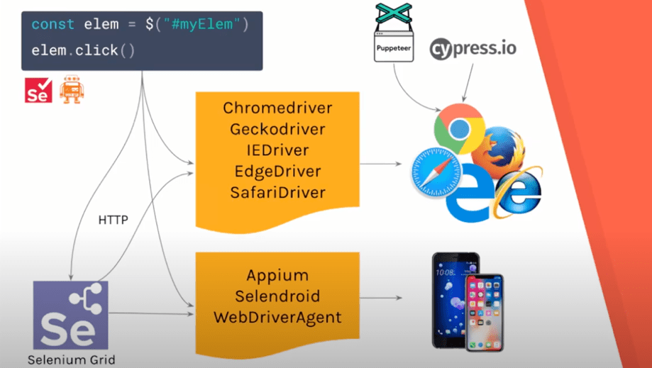

# Webdriverio
## What is WebdriverIO? 

**WebdriverIO** is a popular JavaScript test automation framework that runs on Node.js. 
It allows us to automate any application written with modern web frameworks such as React, Angular, Polymer or Vue.js as well as native mobile applications for Android and iOS.

**WebdriverIO** has its own implementation of the Webdriver specification that allows us to run tests in multiple browsers. 

Here’s a quick overview of what happens when we run our WebdriverIO test script:

* First, our test script will talk to a driver using a HTTP request.
* Then, the driver will trigger an event in the browser to take the necessary action provided via the HTTP request.



- [Webdriverio](#webdriverio)
- [What will be discuss in this course?](#what-will-be-discuss-in-this-course)
  - [Prerequisite](#prerequisite)
    - [The only requirement is that you need to have Node.js installed](#the-only-requirement-is-that-you-need-to-have-nodejs-installed)
    - [Integration Development Evironment(IDE)](#integration-development-evironmentide)
    - [Language require for WebdriverIO Framework](#language-require-for-webdriverio-framework)
  - [SetUp & Resources](#setup--resources)
  - [Different Frameworks](#different-frameworks)
    - [The WDIO runner currently supports Mocha, Jasmine, and Cucumber](#the-wdio-runner-currently-supports-mocha-jasmine-and-cucumber)
  - [Assertions use in WebdriverIO](#assertions-use-in-webdriverio)
    - [WebdriverIO Assertions](#webdriverio-assertions)
  - [CI/CD Integration](#cicd-integration)
  - [WebdriverIO vs Protractor](#webdriverio-vs-protractor)
    - [**WebdriverIO:**](#webdriverio-1)
    - [**Protractor:**](#protractor)
  - [Advantages & Disadvantages](#advantages--disadvantages)
    - [Advantages:](#advantages)
    - [Disadvantages:](#disadvantages)
  - [Conclusion](#conclusion)
  - [References](#references)


# What will be discuss in this course?
* Prerequisite
* SetUp & Resources
* Different Frameworks
* Assertions use in WebdriverIO
* CI/CD Integration
* WebdriverIO vs Protractor
* Advantages & Disadvantages
* Conclusion
* Reference

## Prerequisite
### The only requirement is that you need to have Node.js installed
* Minimum v12.16.1 is required to use WebdriverIO v6

To verify that you have successfully installed Node.js, run the following command

```shell
node -v
```

[Click here to get Node.js](https://nodejs.org/en/download/)

### Node Package Manager(npm)
We can get **npm** with Node.js 

To verify that you have successfully installed npm, run the following command

```shell
npm -v
```

### Integration Development Evironment(IDE)

* VScode [(Click Here)](https://code.visualstudio.com/)
* atom [(Click Here)](https://atom.io/)
* Eclipse [(Click Here)](https://code.visualstudio.com/)
* Intellege [(Click Here)](https://www.jetbrains.com/idea/download/#section=windows)
### Language require for WebdriverIO Framework

* we need javaScript & typeScript
    * To get more information about javascript & typeScript use the following links:

      [Click here for javaScript](https://javascript.info/)

      [Click here for typeScripts](https://www.typescriptlang.org/docs/)

## SetUp & Resources

To create package file use following commond in project directory

```shell
npm init 
```

* To install webdriverio in system we use following commond

```shell
npm install webdriverio --save-dev
```


To create WebdriverIO CLI tool & run configuration wizard that's help us to configure our test suit 

```shell
npx wdio
```


## Different Frameworks
### The WDIO runner currently supports [Mocha](https://mochajs.org/), [Jasmine](https://jasmine.github.io/), and [Cucumber](https://cucumber.io/).

## Assertions use in WebdriverIO

### WebdriverIO Assertions

We can get info about WebdriverIO Assertions types some of them Migrated from **Chai**

* [WebdriverIO Assertions](https://webdriver.io/docs/assertion/)

Detailed Information about **Chai** Assertion which are used in WebdriverIO

* [Chai Assertions](https://www.chaijs.com/api/assert/)

## CI/CD Integration

* WebdriverIO offers a tight integration to CI systems like **Jenkins**.
  To get more information about **Jenkins** integration [click here](https://webdriver.io/docs/jenkins/).

* WebdriverIO can also integrate with **Docker** container for the more information [click here](https://webdriver.io/docs/wdio-docker-service/).


## WebdriverIO vs Protractor

### **WebdriverIO:**

* There are built-in selectors for React.
* Built-in synchronization of code execution.
* We don’t have to use async/await.
* A small number of waiters out-of-the-box.
* Good code readability.

### **Protractor:**

* There are built-in selectors for Angular and a mechanism of waiting for the page to load and render.
* Requires to use async/await to synchronize the code execution.
* A large number of waiters out-of-the-box.
* Usage of Lazy Elements.

## Advantages & Disadvantages

### Advantages:

* Readable, simple syntax
* Easy to start	
* Simple and fast configuration	
* We can run our tests using WDIO TestRunner or Standalone Mode
* Works with many assertion libraries and testing frameworks (Jasmine, Mocha, Cucumber)	
* Tests on desktop as well as on mobile	

### Disadvantages:
* Current wdio-expect is not applicable to API tests
* Assertions are problematic at the beginning 
* Debugging possible only through WDIO task runner

## Conclusion

* Overall, WebdriverIO makes it easy to set up and configure our tests, and also provides a clean and readable syntax for writing tests. WebdriverIO also provides detailed documentation on all of its APIs as well as a step-by-step guide for integrating the tests with various services and reporters.

## References

* [WebdriverIO Official documents](https://webdriver.io/)
* [Udemy Course](https://www.udemy.com/course/webdriverio-tutorial-nodejs-javascript/)
